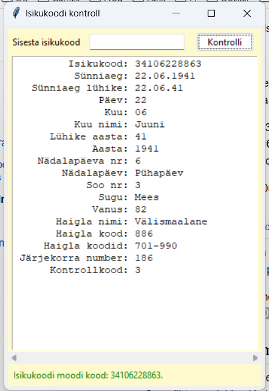
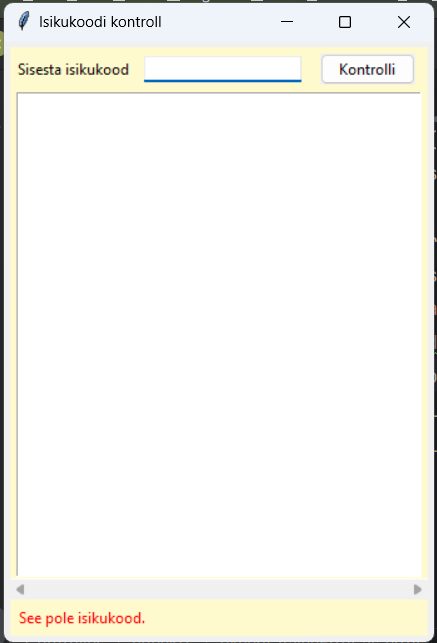
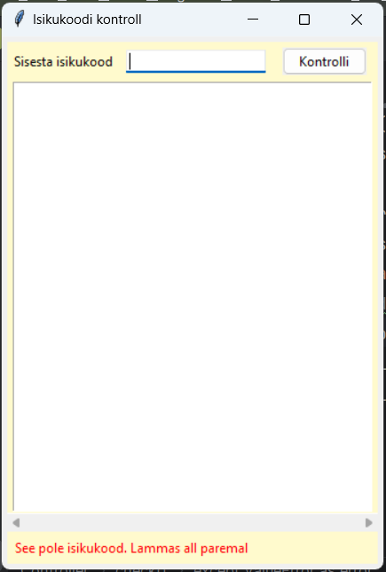

# PersonalCode GUI

Isikukoodi graafiline lahendus, kus algselt puudub isikukoodi 
kontrolli funktsionaalsus. Seda osa hakkavad õpilased tunnis tegema.

## Õige lõpptulemus

### Vigased variandid

# Lingid
* Youtube [Isikukoodi video](https://www.youtube.com/watch?v=zPjJrLbLS4A)
* Vikipedia [Isikukoodi teks](https://et.wikipedia.org/wiki/Isikukood)